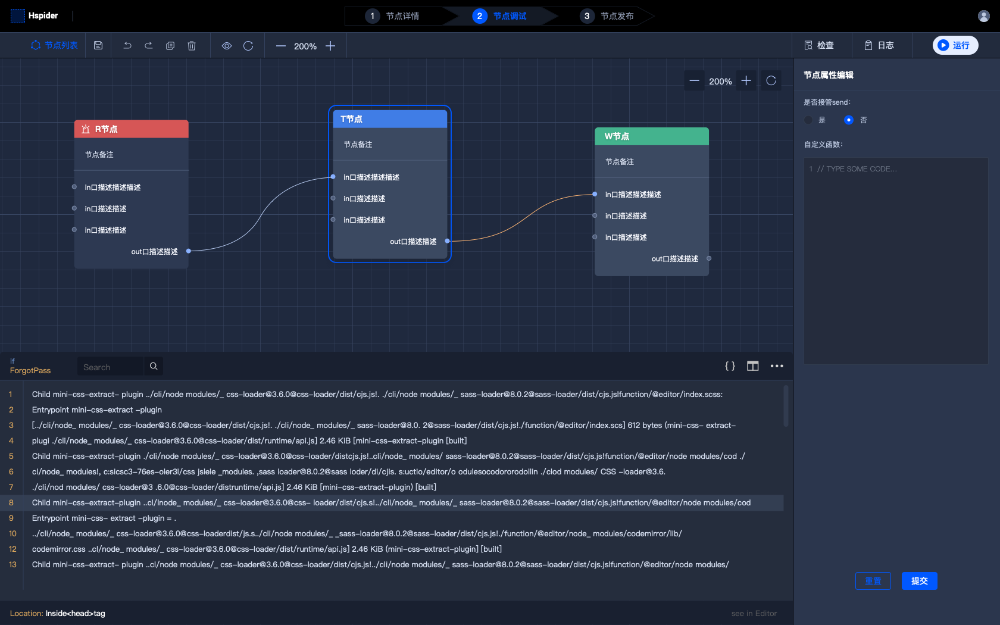

# Hlang

<br />
<br />

<p align="center">
  
</p>

<br />
<br />

<br />
<br />

<p align="center">
<b style="font-size: 32px;line-height: 32px;">A Flow-based programming language for universal applications.</b>
<br />
<br />
<br />
<em>Hlang aims to make programming easier, faster and more comfortable. It avoids coding, repetition and frustration.</em>
<br />
<br />
</p>

<br />
<br />

---

### Ecosystem

#### UI & Devtool

<p align="center">
  
</p>

### Feature

* 😊 Another FBP-Inspired System, totally `Reactive`.
* 🚀 Powerful ecosystem, abundant internal nodes.
* 👬 Just use Node-Like `Readable` | `Writable` | `Transform` Stream API to become a node developer.
* ✊ Production-ready and Enterprise-ready, High Performance.

### 🌰 Quick Start

```javascript
const {
  Flow,
  ReadableNode,
  WriteableNode,
  TransformNode,
  Port,
} = require("@hlang/runtime");

const flowIns = new Flow();

class OneReadableNode extends ReadableNode {
  constructor() {
    super();

    // dig a port named `out`
    Port.O("out").attach(this);
  }

  _read($o) {
    // send packet to `out` port
    $o("out").send({ payload: "hello, world" });
  }
}

class OneTransformNode extends TransformNode {
  constructor() {
    super();

    // dig `in` `out` port
    Port.I("in").attach(this);
    Port.O("out").attach(this);
  }

  _transform($i, $o) {
    $i("in").on((payload) => {
      $o("out").send(payload);
    });
  }
}

class OneWriteableNode extends WriteableNode {
  constructor() {
    super();
    Port.I("in").attach(this);
  }

  _write($i) {
    $i("in").on(console.log);
  }
}

const $R = new OneReadableNode();
const $T = new OneTransformNode();
const $W = new OneWriteableNode();

// connect
$R.O("out").connect($T.I("in"));
$T.O("out").connect($W.I("in"));

// for fun!
flowIns.run($R);
```
